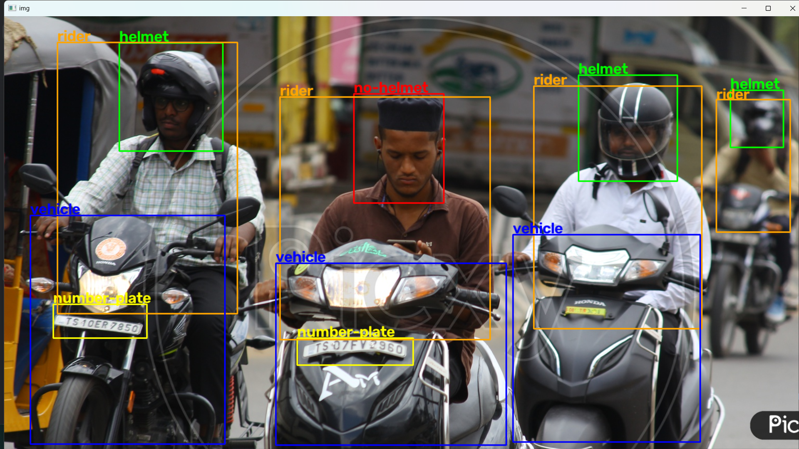
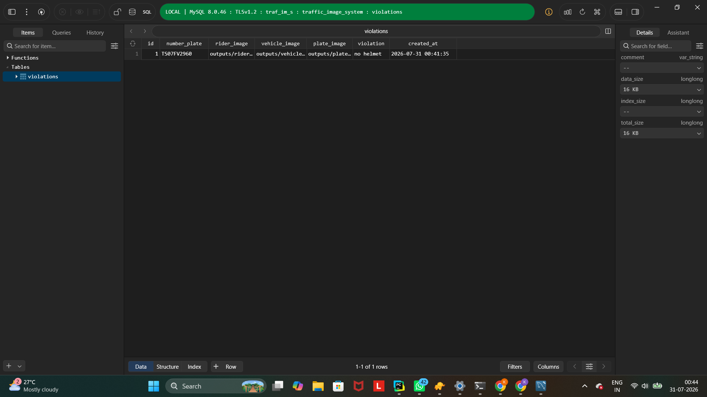

# 🚦 Smart Traffic Violation Detection

An AI-powered Smart Traffic Violation Detection System that automatically detects helmet violations, recognizes vehicle number plates using PaddleOCR, and stores traffic violation records in a MySQL database.

This project leverages **YOLOv8** for object detection, **PaddleOCR** for number plate recognition, **OpenCV** for image processing, and **MySQL** for persistent data storage.

---

## 📌 Features

- 🚗 Detect vehicles in traffic images
- 🏍️ Detect riders on motorcycles
- 🪖 Detect helmet and no-helmet violations
- 🔢 Detect vehicle number plates
- 🔍 Recognize number plate text using PaddleOCR
- 🔗 Associate riders, vehicles, helmets, and number plates
- 💾 Store violation details in a MySQL database
- 🖼️ Save annotated output images with detected violations

---

## 🛠️ Tech Stack

| Technology | Purpose |
|------------|---------|
| Python | Programming Language |
| YOLOv8 | Object Detection |
| PaddleOCR | Number Plate Recognition |
| OpenCV | Image Processing |
| MySQL | Database |
| NumPy | Numerical Operations |

---

## 📂 Project Structure

```text
Smart-Traffic-Violation-Detection/
│
├── association.py
├── database.py
├── main.py
├── ocr.py
├── train.py
│
├── dataset/
│   ├── data.yaml
│   ├── README.dataset.txt
│   └── README.roboflow.txt
│
├── yolo26n.pt
├── .gitignore
└── README.md
```

---

## ⚙️ Installation

### 1. Clone the repository

```bash
git clone https://github.com/hkrish2266/Smart-Traffic-Violation-Detection.git
```

### 2. Navigate to the project folder

```bash
cd Smart-Traffic-Violation-Detection
```

### 3. Create a virtual environment

```bash
python -m venv .venv
```

### 4. Activate the virtual environment

**Windows**

```bash
.venv\Scripts\activate
```

**Linux / macOS**

```bash
source .venv/bin/activate
```

### 5. Install dependencies

```bash
pip install -r requirements.txt
```

---

## 🗄️ Database Configuration

Create a MySQL database.

```sql
CREATE DATABASE traffic_image_system;
```

Create a `.env` file in the project root.

```env
DB_HOST=localhost
DB_USER=your_username
DB_PASSWORD=your_password
DB_NAME=traffic_image_system
```

---

## ▶️ Usage

### Train the YOLO model

```bash
python train.py
```

### Run the traffic violation detection system

```bash
python main.py
```

---

## 🔄 Workflow

1. Load the trained YOLOv8 model.
2. Detect vehicles, riders, helmets, no-helmet riders, and number plates.
3. Associate each rider with the corresponding vehicle and number plate.
4. Crop the detected number plate.
5. Extract the plate number using PaddleOCR.
6. Save violation details in the MySQL database.
7. Save the annotated output image.

---

## 📊 Detection Classes

The model detects the following classes:

- Vehicle
- Rider
- Helmet
- No Helmet
- Number Plate

---

## 📷 Sample Results

Add screenshots of your project here.

Example:

```
screenshots/
├── detection_result.png
├── database_record.png
└── output_image.png
```

Example README section after adding screenshots:

```markdown
### Detection Result



### Database Record


```

---

## 📈 Future Improvements

- Real-time video processing
- Multi-camera support
- Speed violation detection
- Traffic signal violation detection
- Web dashboard
- REST API integration
- Automatic e-Challan generation
- Cloud deployment

---

## 🤝 Contributing

Contributions are welcome.

If you'd like to improve this project:

1. Fork the repository.
2. Create a feature branch.
3. Commit your changes.
4. Open a Pull Request.

---

## 🙏 Acknowledgements

- Ultralytics YOLOv8
- PaddleOCR
- OpenCV
- Roboflow
- MySQL

---

## 👨‍💻 Author

**Hari Krishna**

[](https://github.com/hkrish2266)
[](https://www.linkedin.com/in/hari-krishna-madaka/)
[](https://leetcode.com/u/hari_21072007/)
---

## 📄 License

This project is intended for educational and research purposes.
